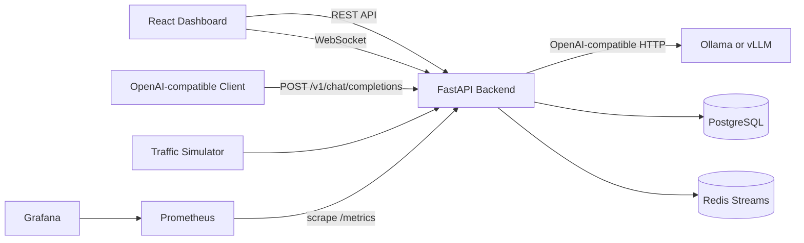

# Inference Ops Platform

`inference-ops-platform` is a production-style real-time operations dashboard and OpenAI-compatible gateway for local and self-hosted AI inference systems. It proxies real chat completions to Ollama or vLLM while tracking p50/p95/p99 latency, token usage, failures, system events, model deployments, and inference node health. A simulator remains available for repeatable demos.

The project is intentionally backend-heavy: the UI exists to exercise and demonstrate the API, database, Redis Streams, WebSocket, observability, Docker, CI, and benchmark paths.

## Why It Matters

AI applications are only useful when inference is reliable, observable, and measurable. This project models the operational layer around inference workers: request tracking, event replay, failure visibility, latency analytics, and live dashboard updates.

## Tech Stack

- Backend: FastAPI, SQLAlchemy, Pydantic
- Database: PostgreSQL
- Realtime/eventing: Redis Streams plus WebSockets
- Frontend: React, TypeScript, Vite, Tailwind CSS, shadcn/ui, TanStack Query, Recharts
- Containers: Docker Compose
- Testing: Pytest and FastAPI TestClient
- CI/CD: GitHub Actions
- Observability: structured JSON logs, Prometheus metrics endpoint, OpenTelemetry-ready layout
- Optional dashboards: Prometheus and Grafana in Docker Compose

## Architecture



See [docs/architecture.md](docs/architecture.md) for the full data flow and tradeoffs.

## Quickstart

Docker path:

```bash
cp .env.example .env
make up
```

Then open:

- Dashboard: http://localhost:5173
- API docs: http://localhost:8000/docs
- Prometheus: http://localhost:9090
- Grafana: http://localhost:3000, login `admin` / `admin`

If Docker is not installed, use the local SQLite path in two terminals:

```bash
cd /Users/henishpatel/Documents/Codex/2026-06-22/r4es/inference-ops-platform
cd backend
python3 -m venv .venv
source .venv/bin/activate
pip install ".[dev]"
cd ..
make backend-local
```

Then open a second terminal:

```bash
cd /Users/henishpatel/Documents/Codex/2026-06-22/r4es/inference-ops-platform
cd frontend
npm install
cd ..
make frontend-dev
```

Local no-Docker URLs:

- Dashboard: http://localhost:5173
- API docs: http://localhost:8000/docs

### Run real inference with Ollama

Start Ollama and pull a model:

```bash
ollama serve
ollama pull gemma3:4b
```

The gateway defaults to Ollama at `http://localhost:11434/v1`. Send a real completion through the platform:

```bash
curl http://localhost:8000/v1/chat/completions \
  -H "Authorization: Bearer dev-token" \
  -H "Content-Type: application/json" \
  -d '{"model":"gemma3:4b","messages":[{"role":"user","content":"Write a Go health handler."}],"stream":true}'
```

The response is passed back as OpenAI-compatible server-sent events. When the stream closes, the platform stores end-to-end latency, time to first token, output tokens per second, token counts, requested and resolved model names, deployment/node linkage, and failures. It then publishes the request event to Redis and connected WebSocket clients. Set `INFERENCE_UPSTREAM_URL` and `INFERENCE_UPSTREAM_API_KEY` to target any other OpenAI-compatible runtime, including vLLM. Set `"stream": false` for a buffered JSON response.

Generate traffic:

```bash
curl -X POST "http://localhost:8000/api/traffic/simulate?count=50" \
  -H "Authorization: Bearer dev-token"
```

## Local Development

Backend:

```bash
cd backend
python -m venv .venv
source .venv/bin/activate
pip install ".[dev]"
uvicorn app.main:app --reload
```

Frontend:

```bash
cd frontend
npm install
npm run dev
```

## Frontend Dashboard

The first screen is the operator dashboard itself. It uses the existing Vite app with:

- React 18 and TypeScript
- Tailwind CSS v4 through `@tailwindcss/vite`
- shadcn/ui with the Radix/Nova preset and local component source under `frontend/src/components/ui`
- lucide-react navigation and action icons
- TanStack Query for REST polling and mutation invalidation
- Recharts through shadcn's chart wrapper

Screenshots:

- `docs/screenshots/overview.png` - placeholder for the overview dashboard
- `docs/screenshots/live-events.png` - placeholder for the WebSocket event feed
- `docs/screenshots/nodes.png` - placeholder for node detail and health views
- `docs/screenshots/failures.png` - placeholder for failure triage

### UI Architecture

```text
frontend/src/
  app-style entry: App.tsx
  components/layout/     app shell, sidebar, header, connection status
  components/dashboard/  metric cards, status badges, empty states
  components/charts/     latency, throughput, latency distribution charts
  components/tables/     events, nodes, deployments, requests, failures
  components/ui/         shadcn-generated components
  data/mock-data.ts      typed frontend-only derived/demo metrics
  hooks/                 TanStack Query and WebSocket hooks
  lib/api.ts             REST client
  lib/websocket.ts       WebSocket URL builder
  lib/types.ts           API and UI data contracts
```

The app keeps API clients, transport hooks, derived data, and presentation components separate. Pages compose those pieces without hardcoding backend payloads directly into the UI.

### shadcn/ui Usage

shadcn was initialized with the official CLI:

```bash
cd frontend
npx shadcn@latest init -y -b radix -p nova
```

Components were added with:

```bash
npx shadcn@latest add card table badge tabs button dropdown-menu sheet dialog tooltip select input skeleton alert separator chart switch progress scroll-area textarea checkbox label
```

To add more components later:

```bash
cd frontend
npx shadcn@latest add <component-name>
```

Review generated files in `frontend/src/components/ui` before using them. Community registry components should be treated as third-party code and reviewed before adoption.

### Backend and WebSocket Integration

The frontend reads:

- `VITE_API_URL`, default `http://localhost:8000`
- `VITE_API_TOKEN`, default `dev-token`

Connected to real backend data:

- `/api/analytics/overview`
- `/api/analytics/latency`
- `/api/nodes`
- `/api/deployments`
- `/api/events`
- `/api/requests`
- `/api/traffic/simulate`
- `/ws/events?token=dev-token`

Simulated or frontend-derived data:

- CPU, memory, GPU usage, queue depth, and node health score are deterministic UI placeholders derived from backend node state.
- Deployment average latency, error rate, and throughput are derived from recent request rows until the backend exposes deployment-level metrics.
- Benchmark scenarios and in-browser benchmark history are UI-only; each benchmark run still calls the real `/api/traffic/simulate` endpoint.
- Retry, mark-reviewed, pause-routing, restart-workers, scale-replicas, token-rotation, and audit-snapshot controls are staged UI actions unless backend endpoints are added.

### Frontend Checks

```bash
cd frontend
npm run lint
npm run build
```

## API Examples

```bash
curl -H "Authorization: Bearer dev-token" http://localhost:8000/api/analytics/overview
curl -H "Authorization: Bearer dev-token" http://localhost:8000/api/nodes
curl -H "Authorization: Bearer dev-token" http://localhost:8000/api/events
```

Detailed examples are in [docs/api.md](docs/api.md).

## WebSocket/Event Flow

Clients connect to:

```text
ws://localhost:8000/ws/events?token=dev-token
```

When traffic is simulated, the backend persists request and event rows, appends the event to Redis Stream `inference.events`, and broadcasts the same event to connected WebSocket clients. On reconnect, the service attempts to replay recent events from Redis.

## Benchmark Results

Sample local benchmark on the Docker Compose stack:

```text
Inference Ops benchmark
requests=250 failures=19 elapsed_seconds=3.42
client_avg_ms=13.17
client_p50_ms=11.82
client_p95_ms=24.39
client_p99_ms=31.06
```

Run it locally:

```bash
make benchmark
```

See [docs/benchmarking.md](docs/benchmarking.md) for details.

## Testing

```bash
cd backend
pip install ".[dev]"
pytest
ruff check app tests scripts
```

The test suite covers health checks, token protection, node/deployment APIs, buffered and streaming upstream proxying, interrupted-stream telemetry, simulated traffic analytics, and WebSocket event flow.

## CI/CD

GitHub Actions runs:

- Backend dependency install
- Ruff linting
- Pytest
- Frontend dependency install
- TypeScript/Vite production build

Workflow: [.github/workflows/ci.yml](.github/workflows/ci.yml)

## Roadmap

- Replace demo token auth with JWT/OIDC.
- Add a real Redis consumer group for multi-worker event processors.
- Add OpenTelemetry SDK exporters for traces.
- Add Locust load tests and benchmark history persistence.
- Add Grafana dashboards as provisioned JSON.
- Add row-level tenant ownership for multi-user deployments.

## Resume Bullet

Built a production-style real-time inference operations platform using FastAPI, PostgreSQL, Redis Streams, WebSockets, Docker, and OpenTelemetry-ready instrumentation, supporting authenticated dashboards, event replay, CI-tested APIs, and benchmarked p95 latency metrics.

## Inspired By / References

This project uses standard patterns from FastAPI, SQLAlchemy, Redis Streams, Prometheus, and React dashboard applications. It is original scaffolding for portfolio use and does not copy another repository.
