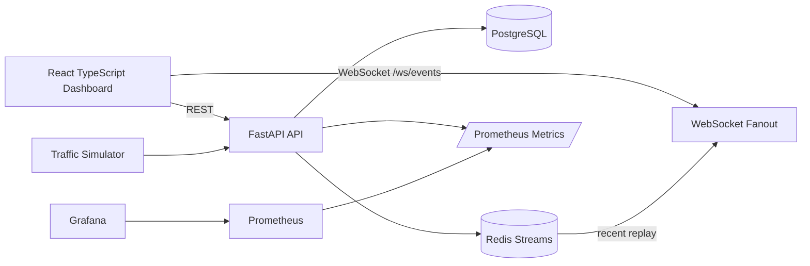

# Architecture

`inference-ops-platform` is a production-style local operations dashboard for simulated AI inference workers. It focuses on backend architecture signals: relational modeling, event streams, WebSocket fanout, API design, benchmarkability, and containerized local development.

## Backend modules

- `app/models`: SQLAlchemy models for nodes, deployments, requests, latency metrics, events, and demo users.
- `app/api`: REST and WebSocket routes grouped by resource.
- `app/services/event_bus.py`: Redis Streams publisher plus in-process WebSocket broadcast.
- `app/services/simulator.py`: deterministic demo topology plus randomized inference traffic.
- `app/services/analytics.py`: overview counts and percentile calculations.
- `app/observability`: structured logging setup and Prometheus metrics exposed by `app/main.py`.

## Data flow

1. A client or worker calls `POST /api/traffic/simulate`.
2. The backend creates inference request rows and latency metric rows in PostgreSQL.
3. The backend persists a `system_events` row.
4. The event is appended to the Redis stream `inference.events`.
5. Connected WebSocket clients receive the event immediately.
6. The dashboard refreshes aggregates and renders latency/failure views.

## Tradeoffs

- Authentication is intentionally simple: a bearer API token. This is enough to show protected APIs without pretending to implement enterprise identity.
- Tables can be auto-created in local development. Alembic is included for realistic migration structure.
- WebSocket fanout is in-process for a single backend instance. Redis Streams keep a replayable event log and provide the upgrade path for multi-process consumers.
